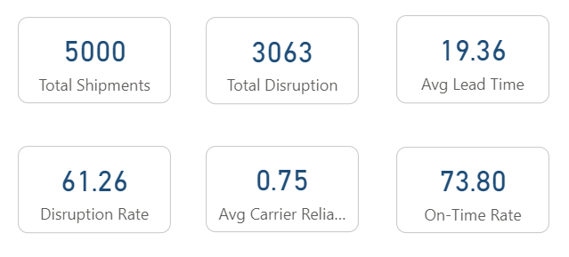
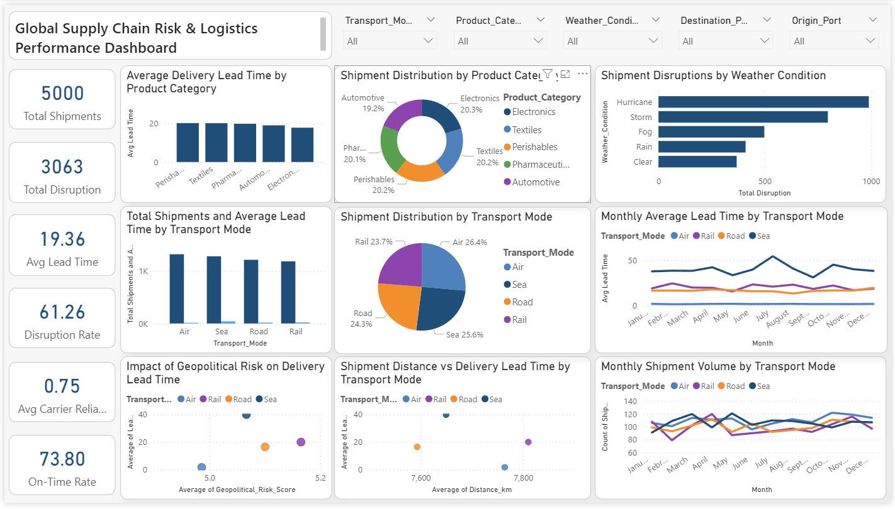

# Global Supply Chain Risk & Logistics Performance Analysis

## Overview
This project analyzes global shipment data to understand **logistics performance, disruption patterns, and operational risks**.  
The analysis was conducted using **SQL for data exploration** and **Power BI for visualization**.

The dashboard helps identify factors affecting **delivery lead time, shipment disruptions, and transport efficiency**.

---

## Tools Used

- SQL (MySQL)
- Power BI
- Power Query
- DAX
- Data Visualization

---

## Dataset

The dataset contains **5000 global shipment records** with logistics and operational attributes.

### Key Columns

| Column | Description |
|------|-------------|
| Shipment_ID | Unique shipment identifier |
| Date | Shipment date |
| Origin_Port | Shipment origin |
| Destination_Port | Shipment destination |
| Transport_Mode | Air, Sea, Rail, Road |
| Product_Category | Product type |
| Distance_km | Shipment distance |
| Weight_MT | Shipment weight |
| Fuel_Price_Index | Fuel price indicator |
| Geopolitical_Risk_Score | Regional risk score |
| Weather_Condition | Weather during shipment |
| Carrier_Reliability_Score | Carrier reliability |
| Lead_Time_Days | Delivery time |
| Disruption_Occurred | Shipment disruption indicator |

---

## Key KPIs

The dashboard tracks the following performance metrics:

- Total Shipments  
- Total Shipment Disruptions  
- Average Delivery Lead Time  
- Shipment Disruption Rate  
- Average Carrier Reliability Score  
- On-Time Delivery Rate

  

---

## Dashboard Preview



---

## SQL Example Queries

```sql
-- Geopolitical Risk Analysis
SELECT 
CASE 
WHEN Geopolitical_Risk_Score < 3 THEN 'Low Risk'
WHEN Geopolitical_Risk_Score < 6 THEN 'Medium Risk'
ELSE 'High Risk'
END AS risk_level,
COUNT(*) AS shipments,
AVG(Lead_Time_Days) AS avg_lead_time,
SUM(Disruption_Occurred)/COUNT(*)*100 AS disruption_rate
FROM shipments
GROUP BY risk_level;

-- Carrier Performance
SELECT 
Carrier_Reliability_Score,
AVG(Lead_Time_Days) AS avg_lead_time,
SUM(Disruption_Occurred)/COUNT(*)*100 AS disruption_rate
FROM shipments
GROUP BY Carrier_Reliability_Score
ORDER BY Carrier_Reliability_Score DESC;

-- Route Analysis
SELECT 
Origin_Port,
Destination_Port,
COUNT(*) AS shipments,
SUM(Disruption_Occurred) AS disruptions
FROM shipments
GROUP BY Origin_Port, Destination_Port
ORDER BY disruptions DESC
LIMIT 10;

-- Distance Impact
SELECT 
CASE
WHEN Distance_km < 2000 THEN 'Short'
WHEN Distance_km < 8000 THEN 'Medium'
ELSE 'Long'
END AS distance_category,
AVG(Lead_Time_Days) AS avg_lead_time,
SUM(Disruption_Occurred)/COUNT(*)*100 AS disruption_rate
FROM shipments
GROUP BY distance_category;
```

---

## Project Structure

```
supply-chain-risk-analysis
│
├── Data
│   global_supply_chain_risk_2026.csv
│
├── SQL
│   analysis_queries.sql
│
├── Power Bi
│   supply_chain_dashboard.pbix
│
├── Dashboard_images
│   main_dashboard.png
│
├── Report
│   supply_chain_risk_analysis_project.pdf
│
└── README.md
```

---

## Skills Demonstrated

- SQL Data Analysis  
- Power BI Dashboard Development  
- Data Cleaning & Transformation  
- Business Intelligence Reporting  
- Data Visualization  
- Insight Generation  

---

## Author

**Rushikesh Patil**

Data Analyst | SQL | Power BI | Data Visualization

---

## Portfolio Purpose

This project was created as part of a **data analytics portfolio to demonstrate SQL analysis and business intelligence dashboard development skills.**
